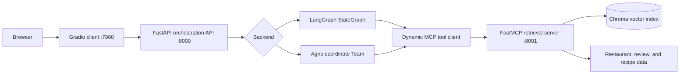

# Agentic Restaurant RAG

Agentic Restaurant RAG is an expanded implementation of IBM's
[RAG and Agentic AI Capstone Project](https://www.coursera.org/learn/rag-and-agentic-ai-capstone-project?specialization=ibm-rag-and-agentic-ai).
It updates the original collection of isolated study materials and lab
exercises into a cohesive, deployable client-server application.

Presented in the UI as Connoisseur Companion, the application separates its
MCP retrieval server, orchestration API, and web client into independently
runnable services. It also replaces illustrative multi-agent patterns with
genuine **LangGraph** and **Agno** orchestration implementations.

## My contributions

The IBM capstone provided the original learning exercises and project
inspiration. My contribution was to re-architect and implement those materials
as the cohesive application in this repository. Specifically, I:

- designed the three-service architecture that separates the Gradio client,
  FastAPI orchestration API, and FastMCP retrieval server behind typed
  HTTP and MCP contracts;
- implemented two interchangeable orchestration backends: an eight-node
  LangGraph workflow and a five-member Agno coordinate team operating over the
  same retrieval tools and API contract;
- upgraded LangGraph from fixed retrieval calls to runtime MCP schema
  discovery, model-directed tool selection, native `ToolNode` execution,
  bounded follow-up rounds, and parallel specialist fan-out/fan-in;
- built persistent Chroma semantic retrieval with structured metadata filters,
  content-hash incremental indexing, stale-record cleanup, stable cross-corpus
  identifiers, and deterministic TF-IDF fallback;
- added session-aware conversation handling, bounded prompt context,
  partial-retrieval-failure recovery, health and readiness endpoints, typed API
  validation, and actionable error responses;
- made model access configurable through OpenAI-compatible endpoints, including
  provider-specific token and reasoning settings shared by LangGraph and Agno;
- containerized the production and test workflows with non-root execution,
  health-gated startup, persistent caches, and separate service lifecycles;
- created a non-root VS Code Dev Container with editable installation,
  reload-enabled services, persistent development volumes, and configured
  Python quality tooling;
- authored 43 offline automated tests across 13 test modules and configured
  Pytest, Ruff, strict mypy checking, and the package's `py.typed` marker; and
- documented the architecture, operation, extension workflow, security
  boundaries, and the process for adding MCP tools that both orchestration
  frameworks can discover.

The application provides two real orchestration implementations over the same
MCP retrieval service:

- **LangGraph** — an explicit state graph that discovers MCP tools, lets the
  model select and call relevant tools, runs parallel specialist analysis, and
  performs fan-in synthesis.
- **Agno** — a coordinate-mode Agno team whose leader delegates among five
  specialized agents, including an MCP-connected retrieval agent.

Both backends use the same API contract and the same MCP tools, making their
behavior directly comparable.

## Architecture



The MCP boundary is intentional: orchestration code does not read project data
directly. Data access and retrieval are independently deployable and can later
be replaced with a managed vector database without changing the client API.

The two backends intentionally demonstrate different orchestration semantics.
LangGraph keeps an inspectable graph topology, but its retrieval stage is
dynamic: it discovers the server's current tool schemas, binds them to the
model, and uses a bounded `select_tools -> tools` loop before waiting for every
specialist branch. Agno uses its native coordinate `Team`: a leader selects
agents, delegates work, and synthesizes their responses dynamically. Both are
real framework execution paths rather than hand-written agent loops.

## Quick start with Docker Compose

Prerequisites:

- Docker with the Compose plugin
- An OpenAI-compatible chat model with reliable tool/function calling

Create the runtime environment file:

```powershell
Copy-Item .env.example .env
```

Set `LLM_MODEL` and either `OPENAI_API_KEY` or `OPENAI_BASE_URL` in `.env`.
Keyless local Ollama or vLLM endpoints only require `OPENAI_BASE_URL`; the
client supplies a non-secret SDK placeholder internally.

When Docker Compose calls a model running on the host, use
`OPENAI_BASE_URL=http://host.docker.internal:11434/v1` (adjust the port for
your server). `localhost` inside the API container refers to that container,
not the host.

For Ollama, also set `LLM_MAX_TOKENS_PARAMETER=max_tokens`. The default
`max_completion_tokens` matches current OpenAI models. `LLM_TEMPERATURE` is
optional and omitted when blank so reasoning models that reject it remain
usable. When using GPT-5.6 with function tools through Chat Completions, set
`LLM_REASONING_EFFORT=none`; leave it blank for providers that do not support
the parameter.

Then start all three services:

```powershell
docker compose up --build
```

Open:

- Gradio client: <http://localhost:7860>
- FastAPI documentation: <http://localhost:8000/docs>
- MCP endpoint: <http://localhost:8001/mcp>

Choose either `langgraph` or `agno` in the client before sending a request.

## API

### Health

```text
GET /healthz
```

This is process liveness and always returns HTTP 200 while the API is running.
Backend availability is included in its response.

### Readiness

```text
GET /readyz
```

This returns HTTP 200 only when at least one orchestrator is configured and
the MCP retrieval service is usable. Compose uses this endpoint before
starting the web client.

### Available orchestration backends

```text
GET /v1/backends
```

### Chat

```text
POST /v1/chat
Content-Type: application/json

{
  "message": "Find a romantic Japanese restaurant and a related recipe",
  "backend": "langgraph",
  "session_id": "optional-client-session-id"
}
```

The response contains the final answer, selected backend, session identifier,
and execution metadata.

## MCP tools

The retrieval server exposes tools for:

- semantic restaurant search with optional metadata constraints;
- exact restaurant details;
- semantic recipe search over recipe text and generated image descriptions;
- restaurant review lookup;
- corpus statistics and service health.

Both orchestration backends discover these definitions from the MCP server.
LangGraph uses `MultiServerMCPClient.get_tools()` to convert the exposed MCP
schemas into LangChain tools, binds the complete discovered set to its chat
model, and delegates execution to LangGraph's `ToolNode`. The model chooses a
minimal relevant subset for each request and can make follow-up calls using
identifiers returned by an earlier tool. `LANGGRAPH_MAX_TOOL_ROUNDS` bounds
that loop.

The discovered tools are cached for the lifetime of the LangGraph backend.
After adding or changing an MCP tool, restart the MCP and API services so the
API loads the new schema. See [CONTRIBUTING.md](CONTRIBUTING.md#adding-an-mcp-tool)
for the implementation and test checklist.

`RETRIEVAL_MODE=semantic` uses a persistent Chroma index. A deterministic
lexical mode is available for tests and constrained environments. The first
semantic startup downloads Chroma's default local embedding model; Compose
persists both that model cache and the vector index in named volumes.

## Development container

The repository includes a complete VS Code-compatible development container.
It attaches the editor to a non-root Python 3.12 container and starts the MCP,
reload-enabled FastAPI, and Gradio services as Compose sidecars.

1. Create `.env` from `.env.example` and configure the model.
2. Stop the normal Compose stack if it is running because both environments
   publish ports 7860, 8000, and 8001:

   ```powershell
   docker compose down
   ```

3. In VS Code with the Dev Containers extension, run **Dev Containers: Reopen
   in Container**.

The container installs the project with development dependencies and mounts
the working tree at `/workspaces/agentic-restaurant-rag`. Run validation from
the attached terminal:

```powershell
pytest -q
ruff check .
mypy
```

Python changes in `src` reload the API automatically. Restart the `mcp` or
`web` sidecar after changing their process code. Rebuild the development
container after changing `pyproject.toml` or `.devcontainer/Dockerfile`.

## Local development

Python 3.11 or 3.12 is supported.

```powershell
python -m venv .venv
.\.venv\Scripts\Activate.ps1
python -m pip install -e ".[dev]"
Copy-Item .env.example .env
```

The application loads `.env` automatically. Its checked-in defaults use
`localhost` and workspace-relative data paths; Compose overrides those values
with container service names and `/app` paths.

Run each service in its own terminal:

```powershell
python -m connoisseur.mcp.server
```

```powershell
python -m uvicorn connoisseur.api.app:app --host 0.0.0.0 --port 8000
```

```powershell
python -m connoisseur.client.gradio_app
```

Run the tests without contacting an LLM or downloading an embedding model:

```powershell
pytest -q
```

Or run the same suite in the containerized test stage:

```powershell
docker build --target test -t agentic-restaurant-rag:test .
docker run --rm agentic-restaurant-rag:test
```

## Configuration

| Variable | Purpose |
|---|---|
| `LLM_MODEL` | Chat model identifier used by both backends |
| `OPENAI_API_KEY` | Credential for OpenAI or an authenticated compatible endpoint |
| `OPENAI_BASE_URL` | OpenAI-compatible local or remote endpoint URL |
| `LLM_MAX_TOKENS_PARAMETER` | `max_completion_tokens` (current OpenAI) or `max_tokens` (many local APIs) |
| `LLM_MAX_TOKENS` | Maximum output tokens for each model call |
| `LLM_TEMPERATURE` | Optional sampling temperature; blank omits the field |
| `LLM_REASONING_EFFORT` | Optional reasoning level; use `none` for GPT-5.6 function tools through Chat Completions |
| `MCP_SERVER_URL` | Streamable HTTP MCP endpoint used by orchestrators |
| `DATA_ROOT` | Root containing the `data` corpus directory |
| `CHROMA_PATH` | Persistent vector-index directory |
| `RETRIEVAL_MODE` | `semantic` or `lexical` |
| `RETRIEVAL_TOP_K` | Default number of retrieved candidates |
| `LANGGRAPH_MAX_TOOL_ROUNDS` | Maximum MCP selection/execution rounds per LangGraph request (1–10) |
| `API_BASE_URL` | API address used by the Gradio service |
| `REQUEST_TIMEOUT_SECONDS` | Timeout for each model or MCP operation |
| `CLIENT_TIMEOUT_SECONDS` | End-to-end Gradio-to-API request timeout |
| `MAX_HISTORY_MESSAGES` | Recent messages passed to either orchestrator |

## Data sources

The deployable service currently uses:

- `data/restaurants.json`
- `data/reviews.json`
- `data/recipes.json`

Generated image descriptions remain part of recipe retrieval. Raw images are
not stored in this repository and can later be served from object storage.
See [`data/README.md`](data/README.md) for corpus notes and the publication
rights reminder.

## Security and deployment notes

Source artifacts removed during repository cleanup contained a plaintext API
credential. Treat it as compromised and rotate it before publishing this
repository. No credential or notebook is included in the application tree or
Docker image.

For an internet-facing deployment, add TLS and authentication at an ingress or
API gateway, store secrets in the deployment platform’s secret manager, restrict
the MCP service to the private network, and replace local Chroma persistence
with a backed-up or managed vector store where appropriate.

See [CONTRIBUTING.md](CONTRIBUTING.md) for the development workflow and
[SECURITY.md](SECURITY.md) for repository-specific security guidance.
